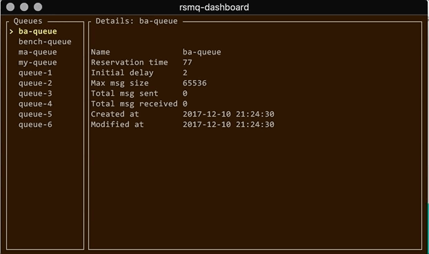

Rsmq-dashboard is a terminal UI to inspect RSMQ queues written in Rust. Developed for use with [rsmq-rust](https://crates.io/crates/rsmq) but should work with the [original Javascript RSMQ implementation](https://github.com/smrchy/rsmq) as well.

Your queues are listed on the left and the queue attributes of the selected queue are shown on the right. Simple, effective! :)

To quit the dashboard, press `q`.

